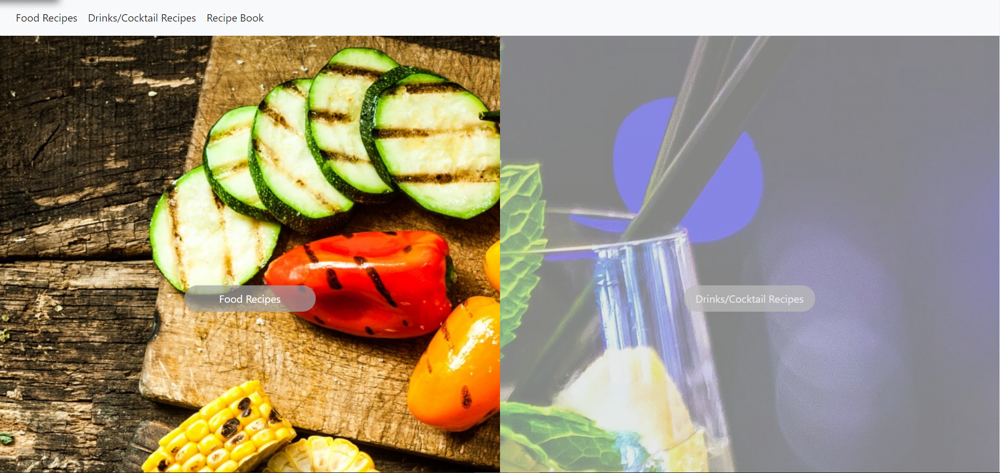

# Food & Drink Recipe Book Builder

[Go To Site](https://daysloth.github.io/Food-drink-searchApp/)

## Description 

Short description

## Testing

AS a user with food allergies, I WANT to search for recipes that consider my allergies SO THAT I can build a worry-free recipe book

GIVEN an option to search for food or drink recipes using inputs,
WHEN I select which type of recipe I want to search for, then I am presented with a seperate search page
WHEN I select a recipe search, then I am presented with checkboxes for different allergies
WHEN the results are returned, then I can view details of the recipe such as prep time and servings, and a button that expands a modal
WHEN I click on the modal, then I can view all ingredients, instructions, and am presented with the option to save the recipe to my locally stored recipe book
WHEN I click on the drink search, then I am presented with the option to search by name or ingredient
WHEN the results are returned, then I can view details of the drink by clicking a modal
WHEN I click to view the modal, then I am presented with the ingredients, instructions, and an option to add to my locally stored recipe book 
WHEN I want to view recipes, then I am presented with a seperate page thta holds all saved food and drink recipes
WHEN I want to remove a recipe, then I can click a button to remove any recipe from my recipe book

## Contributiors

[Allister(DaySloth)](https://github.com/DaySloth), [Kate(hilekat)](https://github.com/hilekat), [Tahliyah(t-mims)](https://github.com/t-mims), [Teshera(tlee0825)](https://github.com/tlee0825)

## License

Copyright (c) Vanderbilt. All rights reserved.

Licensed under the [MIT](https://choosealicense.com/licenses/mit/) license
